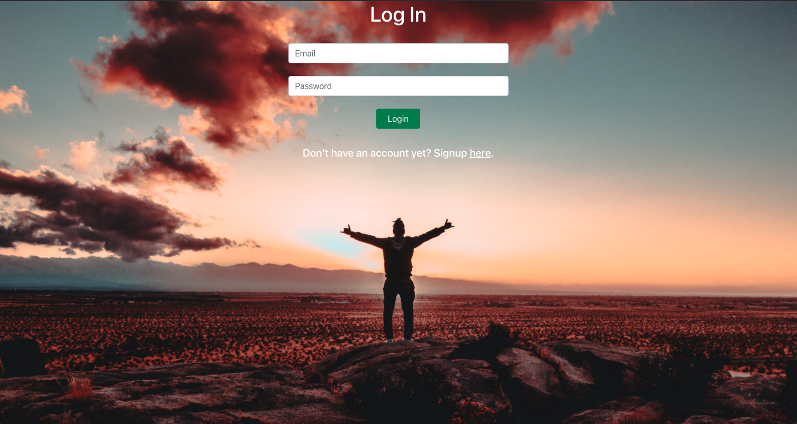
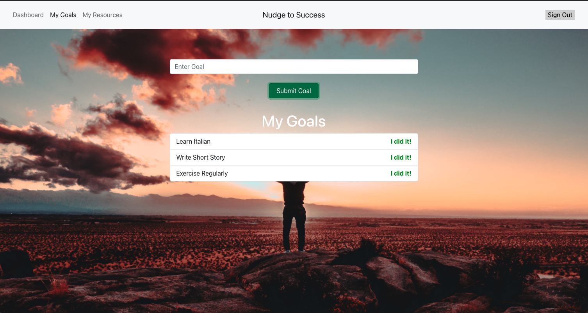
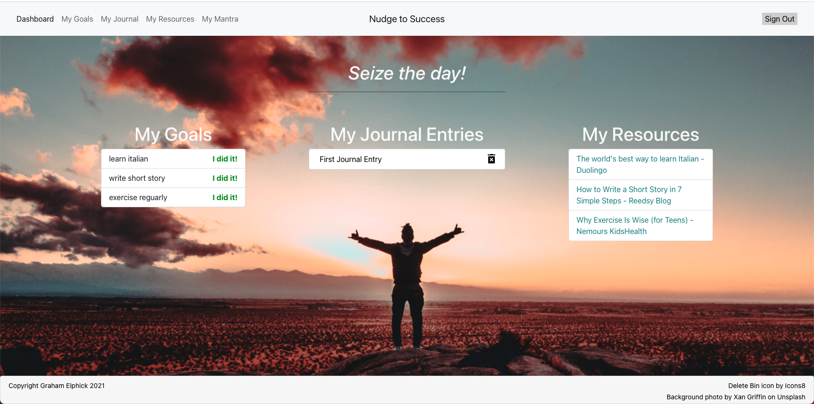
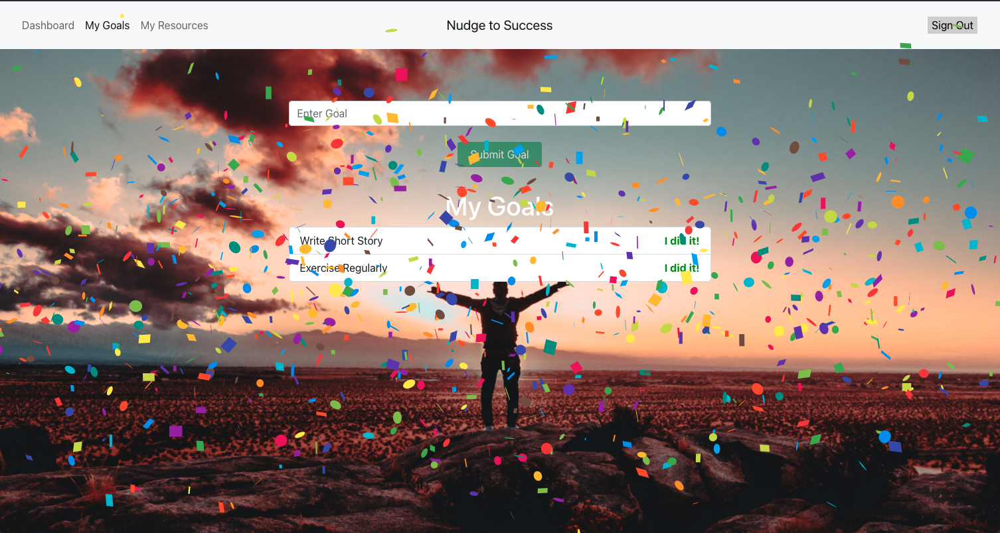

# Nudge to Success

## Table of Contents
* [Description](#description)

* [Deployed App](#deployed-app)

* [Screenshots](#screenshots)

* [Installation](#installation)

* [Usage](#usage)

* [Questions](#questions)

## Description
Nudge to Success is a central, motivation hub, designed to help people achieve their goals. The application allows the user to enter their various goals and provides them with automatically-generated resources to kickstart their journey towards completing said goals.

## Deployed App
https://self-improvement-motivator.herokuapp.com/

## Screenshots

## Installation
npm install

## Usage
Clone repository, npm install, npm start.

OR

Run deployed app: https://self-improvement-motivator.herokuapp.com/

## Questions
My GitHub: https://github.com/grahamelphick